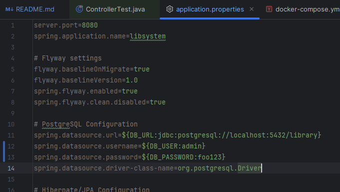
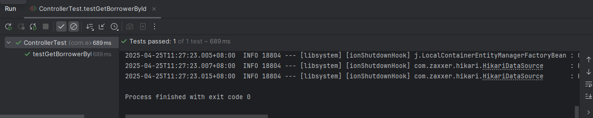
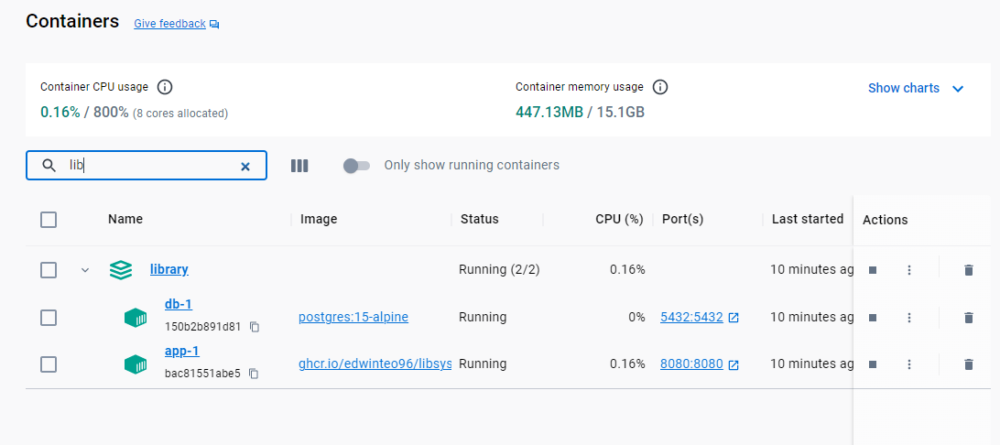
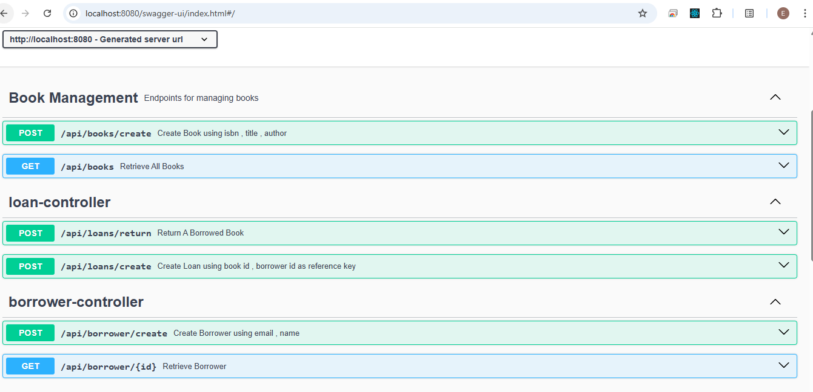

# Library Management API

Backend System CRUD for sample library management application. Developed using Java 17 with Spring Boot bunbled with maven build tools.

## Functions
The API consist of the following functionality for the library management system.
1) Create borrower
2) Create book
3) Create loan
4) View borrower
5) View book
6) Return book

## Assumptions
The following assumptions applied throughout this project
- **Book Copies** : Book created twice is automatically assumed to create copies directly.
- **Loan Creation** : Loan books require two parameter , borrower email and book id. System will auto assign available copies to the borrower.
- **Email Unique** : Borrower email is unique , if double entry will be blocked.
- **User Info** : System able to get user information , including all loan records.

## Implementation Phase

This section discuss about the technologies used in developing this project

### Backend Technologies
- **Spring Boot** : Core Framework To Facilitate the REST Endpoint using @RestControllers.
- **Spring Data JPA** - Used to connect to database and retrieve data.
- **Postgres RDBMS**
- **Docker Compose** - Compose build is used to build the app and db services in one stack. Easier for deployment .
- **Docker Image** - Package the project into docker image , pushed to github container register and pulled to project.
- **JUnit Jupiter Testing** - Perform unit test via mockMvc for all the controller endpoint.
- **Flyway (DB Migration Tools)** : Facilitate the Database Initialization Process using Flyway Migrate , this allow developer to sync all DB changes and just focus on developing task.
- **Maven**: Bundling Tools to build the project
- **Swagger OpenAPI** : Frontend UI to help define, document, and visualize RESTful API. Primarily used for documentation and testing the functionality of the library system.
- **Github Container Register** : Docker image is uploaded to github container registry so that everyone can download the App Image and run the docker-compose freely.

## Design Pattern
- **DTO Pattern** : DTO help to abstract away heavy entity that used for database query. This reduce the size of the payload and help to simplify data transmission.
- **Dependency Injection** : Apply DI Concept @Autowired @Components etc to maximize the benefits of using annotation based configuration such as loose coupling and improve reusability.
- **Error Exception Handling (Aspect Programming[AOP])** : Global Error Exception enhance the code readability and improve the code cleanliness without dangling if else statements in the codebase.
- **Service Layer** : Abstract away complex logic from controller. Improve code readability.
- **Controller Layer** : Focus on return API through ResponseEntity with proper payload header status and body for information.
- **RequestBody Validation** : Validation @Valid will ensure the POST message coming in cannot be null else will throw Exception Error.
- **Immutable Java Record** : Records introduced in java 14 allows immutable objects and is best suited for DTO to reduce extra code getter/setter.
- **Java Stream API** : Utilized stream API to better go through the result list to reduce boilerplate code and improve readability and obtain immutability to avoid accidental changes.

## Database Decision
- The reason to choose Postgres over other RDMBS or NoSQL is that Postgres is a full fledge database that supports json , vector and many more features that is suitable to expand in the future.
- Flyway migration tools help to port over the init script so that no manual importing of any scripts is needed.

## Database Design

The database scheme as follows

- borrower( id ,email , name) : Store information about borrower
- book (id,isbn, title , author , create_dt) : Store information about books
- book_copy ( id, book_id ,copy_number , status) : Copies of book , can be used to loan
- loan (id , book_copy_id , borrower_id , loan_date , due_date, return_date , status) : Loan Object , storing which booked is being loan and borrower information.

## Architecture Overview
```
com.example.library
├── advise // Global Exception Advise (AOP)
├── config // Swagger Configuration File
├── controller // REST endpoints
├── dto// Data Transfer Objects in Java Records
├── exception// Exception Records
├── model // Bean Entity
├── repo// JPA Data access
└── service// Abstraction Layer for controller
```
The file is arranged as above accordingly each to their own respective functions.

## MockMVC Overview

In this project , unit test is carried out on the controller functions to test the API endpoint and check the return repsonse.
All Test is compiled insode ControllerTest.java

Step to run the test
1) Using IDE such as Intellij and build in UI , head over to the java class file and press the play button
2) Results will be shown in the bottom tab , either success or fail

Note : To run the unit test , it requires postgres database. Hence , please keep the docker-compose up to perform unit testing.
Note : To run the test locally , require to manually type the database username and pass at the application.properties because it does not belong to and compose stack.


### Sucess Unit Test


The unit test written with mockmvc will show success if the assertion is correct.


## API Endpoints

Books API

| Method | Endpoint           | Description                       |
|--------|--------------------|-----------------------------------|
| POST   | /api/books/create  | Create new book                   |
| GET    | /api/books         | Get all books                     |

Loan API

| Method | Endpoint          | Description |
|--------|-------------------|-------------|
| POST   | /api/loans/return | Return book |
| POST   | /api/loans/create | Create loan |


Borrower API

| Method | Endpoint              | Description          |
|--------|-----------------------|----------------------|
| POST   | /api/borrower/create  | Create borrower      |
| GET    | /api/borrower/{id}    | Get borrower details |


## How to run project

- Step 1 : Download the project from github.

- Step 2 : locate the .env.sample , rename to .env and fill in the username/password and database

- Step 3 : Run the following command 
  - `docker-compose build`
  - `docker-compose up`

- Step 4 : Go to Swagger Location (Links at below to check out the APIs and play around without using Postman)



Once the docker-compose stack is up , you can see two services up and running. App and DB service.

## Swagger UI locations

- Swagger UI: http://localhost:8080/swagger-ui.html
- OpenAPI JSON: http://localhost:8080/v3/api-docs



Note : Swagger can test out the api , just need to fill in accordingly.


## Commands (Do not need to use if not needed)

- Remove library db 

`psql -U admin -d postgres -c "DROP DATABASE library;CREATE DATABASE library"`

- Remove scheme

`DROP SCHEMA public CASCADE;`
`CREATE SCHEMA public;`

- maven clean install , skip the test

`mvn clean install -Dmaven.test.skip=true`


## Docker Command To Push Image (Do not need to use if not needed)
`echo ghp_oAQV55a | docker login ghcr.io -u edwinteo96 --password-stdin`

`docker build -t libsystem .`

`docker tag libsystem ghcr.io/edwinteo96/libsystem:latest`

`docker push ghcr.io/edwinteo96/libsystem:latest`

## Future Improvements
- Authentication/Authorization
  - Spring Security filter to allow authorized personnel to perform loan books.
  - Access control list to seperate out admin funtionality vs normal user.
  - OAuth2 support to obtain AT and verification via Resource server.
- Spring Cloud Initiative
  - Add zipkin to allow distributed error tracing
  - Add cloud config to centralized all the repeated application properties
  - Add Spring cloud gateway to load balance API request via distributed system.
- Complete Full Features of Library System
  - Payment gateway to pay late fines
  - Reserve Books to loan
  - Extend loan duration
- Pagination
  - Include pagination for search query to improve query efficiency.
- Hataeos
  - Adopt hypermedia links to improve developer experience and improve visibility.
- Notification Service
  - Provide notification services via SMTP to send out email to clients to remind the due date.
- Improve CI/CD 
  - Automatically deploy to Cloud Azure or GCP when code commits.

## License

[MIT License](LICENSE)

## Contributing
Contributions are always welcome! Please feel free to submit a pull request for any changes related! :)
